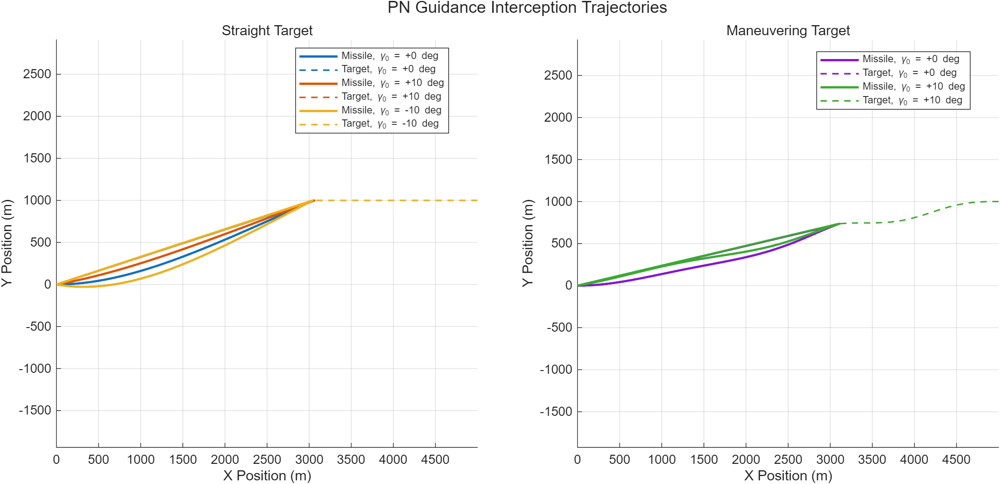
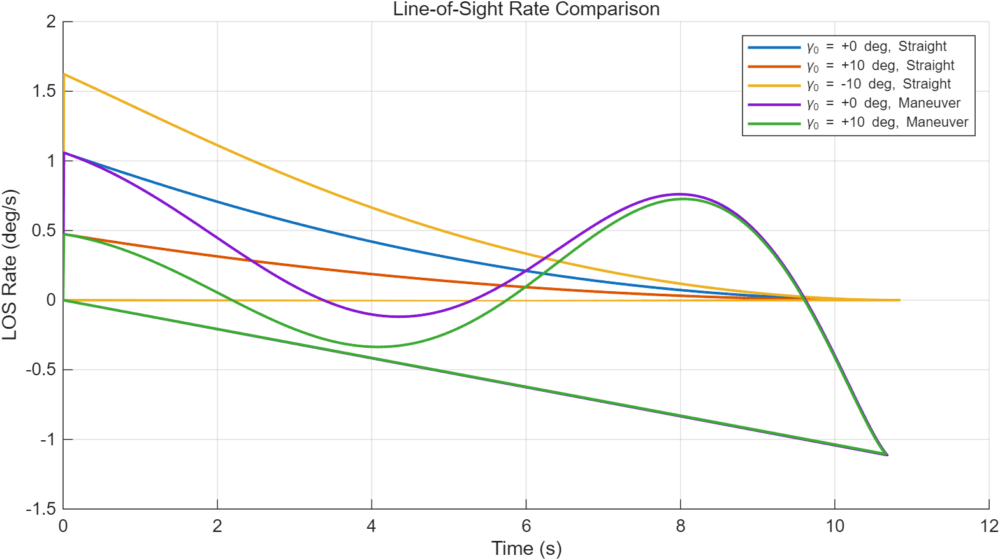
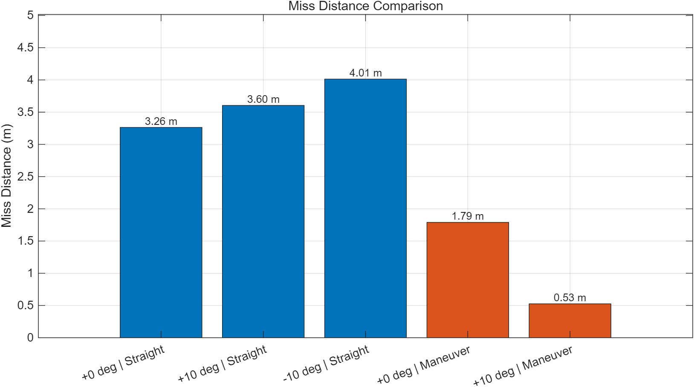

# Proportional Navigation Guidance Simulation

## 1. Background

This project implements a two-dimensional proportional navigation (PN) guidance simulation for missile-target interception. It is designed to demonstrate basic guidance law modeling, relative motion simulation, MATLAB numerical integration, and result analysis.

## 2. Model

The missile and target are modeled as point masses moving in a two-dimensional plane.

- Missile state: position, speed, and heading angle.
- Target state: position, speed, and heading angle.
- Target motion cases: constant-speed straight flight and simple maneuvering flight.

This is a simplified guidance simulation. Aerodynamics, actuator dynamics, seeker noise, gravity, and autopilot inner-loop dynamics are not included.

## 3. Method

The proportional navigation guidance law is implemented as:

```text
a_m = N * V_c * lambda_dot
```

where:

- `a_m` is the missile lateral acceleration command.
- `N` is the navigation constant.
- `V_c` is the closing velocity.
- `lambda_dot` is the line-of-sight angular rate.

The missile heading rate is calculated by:

```text
gamma_dot = a_m / V_m
```

The simulation updates the missile and target positions step by step using numerical integration.

## 4. Simulation Cases

The simulation compares:

- Initial missile heading angles: `0 deg`, `+10 deg`, and `-10 deg`.
- Straight target motion.
- Maneuvering target motion.
- Miss distance under different engagement conditions.

## 5. Results

### Interception Trajectories



### Line-of-Sight Rate Comparison



### Miss Distance Comparison


